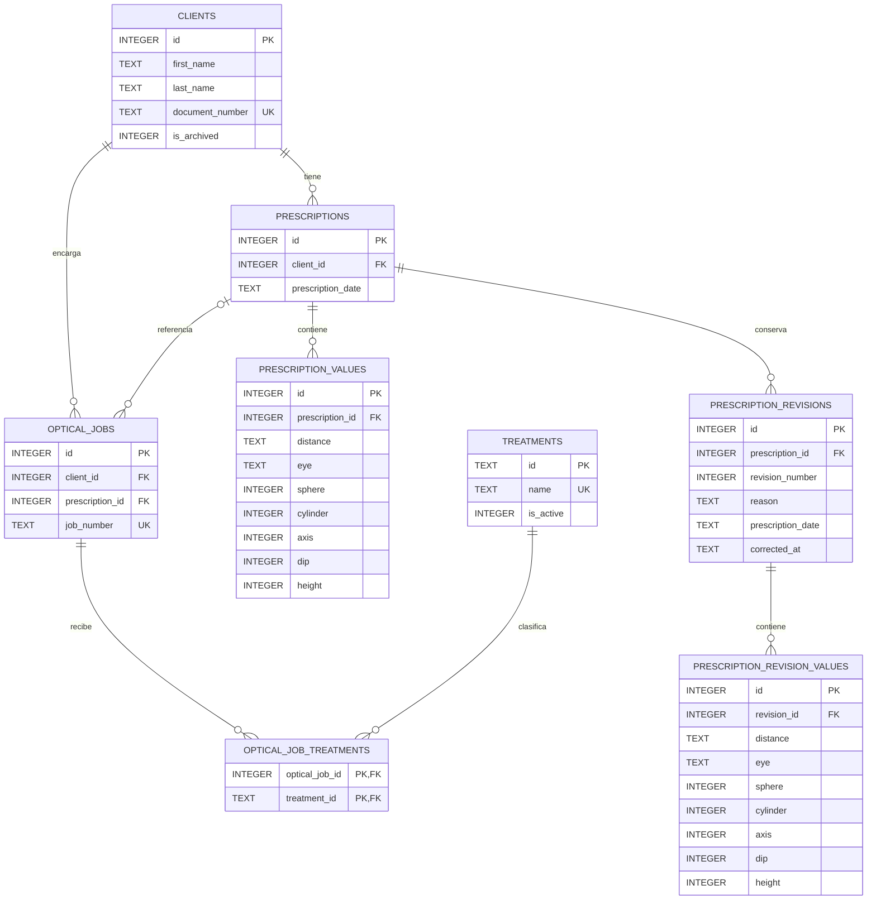

# Base de datos

## Motor y ubicación

La aplicación utiliza `better-sqlite3 13.0.3` y SQLite `3.53.4`. Esta versión requiere Node.js 22 o
posterior y distribuye un binario Windows x64 basado en Node-API. Se comprobó su carga tanto con
Node.js 24.18.0 como con Electron 44.7.0 sin reconstrucción por ABI.

La base de la aplicación se ubica en:

```text
join(app.getPath('userData'), 'optica.sqlite3')
```

No se guarda en el repositorio, `resources`, `app.asar` ni el directorio del instalador. Las pruebas
usan rutas temporales independientes. `OPTICA_QA_USER_DATA_PATH` permite dirigir únicamente una
ejecución de QA completo a un directorio absoluto aislado.

## Diagrama entidad-relación



## Tablas y decisiones

### `clients`

Contiene nombre, apellido, DNI, teléfono, domicilio, fecha de nacimiento, notas, archivado lógico y
timestamps. Nombre y apellido son obligatorios. `document_number` es texto para preservar el valor
ingresado y tiene un índice único parcial solo cuando no es `NULL`; así se evitan DNI informados
duplicados, pero se permiten homónimos y múltiples clientes sin DNI.

No existe una operación de borrado en el repositorio. `is_archived` permite retirar un cliente de las
listas normales sin destruir su historial.

### `prescriptions`

Cada receta pertenece a un cliente y conserva por separado `prescription_date` y `created_at`.
`prescription_date` representa la fecha de la receta, no la fecha de carga. El índice
`(client_id, prescription_date DESC, id DESC)` permite recuperar el historial cronológico sin
reemplazar recetas anteriores.

La restricción única `(id, client_id)` sirve como destino de la clave foránea compuesta de trabajos.

### `prescription_values`

Admite como máximo una fila para cada combinación `(prescription_id, distance, eye)`:

- `distance`: `FAR` o `NEAR`.
- `eye`: `OD` u `OI`.
- `axis`: entero entre 0 y 180, o `NULL`.
- `sphere`, `cylinder`, `dip` y `height`: enteros escalados a centésimas, o `NULL`.

Por ejemplo, `-1.25` se guarda como `-125`, `0.00` como `0` y un campo ausente como `NULL`. La API
TypeScript acepta y devuelve cadenas decimales con hasta dos cifras para evitar redondeos binarios y
mantener clara la diferencia entre cero y ausencia de información.

No se impusieron límites clínicos a esfera, cilindro, DIP o altura porque no fueron confirmados.

### Revisiones de recetas

`prescription_revisions` conserva el encabezado anterior, número correlativo, fecha de corrección y
motivo obligatorio. `prescription_revision_values` conserva la instantánea completa de las filas
ópticas anteriores con la misma precisión escalada. Una corrección mantiene el ID de la receta y se
ejecuta en una transacción: insertar revisión, copiar valores, actualizar encabezado y reemplazar
valores actuales. Si cualquier paso falla, todo se revierte. Una solicitud sin cambios no crea una
revisión innecesaria. No existe borrado permanente de recetas.

### `optical_jobs`

Cada trabajo pertenece a un cliente y puede referenciar una receta. La clave foránea compuesta
`(prescription_id, client_id)` impide asociar la receta de otra persona incluso fuera de la interfaz.
La receta es opcional.

`job_number` se almacena como texto y tiene unicidad parcial cuando está informado; los valores
`NULL` pueden repetirse. No se genera numeración automática.

Valores enumerados opcionales:

- `frame_condition`: `NEW` o `USED`.
- `frame_material`: `ZILO` o `METAL`.
- `color_type`: `FULL` o `GRADIENT`.

Fase 6 utiliza esta estructura existente sin migraciones nuevas. `product` sigue siendo texto libre
para admitir anteojos recetados, lentes de sol y otros productos sin crear inventario. `job_number`
es textual, conserva ceros iniciales y su índice único parcial evita duplicados solo cuando se
informa. Las altas se bloquean para clientes archivados y las ediciones conservan el cliente.

### `treatments`

Catálogo extensible con identificador textual estable, nombre visible e indicador de actividad. La
migración inicial incorpora de manera idempotente:

- `anti-scratch-stark`: Antirrayas Stark.
- `ar-asa-pro`: AR ASA Pro.
- `ar-asa-plus`: AR ASA Plus.
- `edge-polish`: Pulido de bordes.
- `shape-change`: Cambio de forma.

Los tratamientos usados no se eliminan; podrán desactivarse en una fase futura.

En la interfaz se presentan como **Tratamientos y acabados de lentes**. Son características
comerciales del producto óptico, no tratamientos médicos ni procedimientos clínicos.

### `optical_job_treatments`

Tabla de unión muchos a muchos. Su clave primaria compuesta evita asociaciones repetidas y sus dos
claves foráneas impiden referenciar trabajos o tratamientos inexistentes.

## Incertidumbre de la ficha física

La ficha muestra DIP y ALT por fila, pero todavía debe confirmarse con la dueña si son valores
monoculares, binoculares/compartidos, o si su interpretación cambia entre lejos y cerca. El esquema
los conserva en cada combinación distancia-ojo sin declarar una interpretación clínica. Al estar en
una tabla separada, una migración futura puede normalizarlos o agregar mediciones compartidas sin
perder los valores originales.

También debe confirmarse si la unicidad del número de ficha es permanente para todo el historial. La
Fase 2 aplica unicidad cuando se informa, de acuerdo con el criterio preventivo solicitado.

## Integridad e índices

- Todas las tablas de negocio son `STRICT`.
- `PRAGMA foreign_keys = ON` se ejecuta al abrir cada conexión.
- No hay `ON DELETE CASCADE` sobre datos históricos; las relaciones usan `RESTRICT`.
- Las fechas de negocio usan `AAAA-MM-DD`; los timestamps son UTC en formato ISO.
- Los repositorios usan sentencias preparadas y parámetros, nunca concatenan entradas en SQL.
- Las operaciones compuestas de receta-valores y trabajo-tratamientos usan transacciones.
- La edición de una ficha actualiza campos y reemplaza asociaciones de tratamientos de forma
  atómica; si un paso falla, se revierte todo.
- Hay índices para nombres de clientes, archivado, historiales por cliente, receta de un trabajo y
  búsquedas inversas de tratamientos.

## Migraciones

`schema_migrations` registra identificadores y fecha de aplicación. Las migraciones se ejecutan en
orden y cada una se envuelve en su propia transacción. Si falla una sentencia, tanto sus cambios como
su registro se revierten; nunca se borran tablas ni se reinicia la base automáticamente.

Migraciones actuales:

1. `001_initial_schema`: tablas, claves, restricciones e índices.
2. `002_seed_treatments`: catálogo inicial idempotente.
3. `003_prescription_revisions`: tablas e índices de revisiones históricas, sin alterar las
   migraciones anteriores.

Fase 6 no agrega migraciones: las tres tablas de fichas y tratamientos ya representaban el dominio
necesario.

Una migración registrada que el código no conoce detiene la apertura para evitar ejecutar una
versión antigua contra un esquema más nuevo.

## Conexión y errores

`ApplicationDatabase.open()` abre el archivo, configura un timeout ocupado de cinco segundos,
activa claves foráneas y WAL, aplica migraciones y crea repositorios. La conexión se cierra en
`before-quit`.

Una base bloqueada, corrupta o con migración fallida produce un error controlado. La aplicación no
renombra, elimina ni sustituye el archivo afectado y no muestra rutas ni datos clínicos en el mensaje
de error.

## WAL y copias de seguridad

Se usa `PRAGMA journal_mode = WAL` porque mejora la durabilidad y permite lecturas mientras se
realizan escrituras. Mientras una conexión está activa, cambios recientes pueden estar en los
archivos `-wal` y `-shm`; copiar solamente `optica.sqlite3` en ese momento no constituye un backup
seguro.

La Fase 8 deberá usar una copia consistente y verificable, preferentemente la API de backup de
SQLite, y comprobar su restauración. La persistencia en el disco local no protege frente a pérdida o
falla física del equipo.

## Empaquetado futuro

El build compilado externaliza `better-sqlite3` correctamente. Un futuro empaquetador debe incluir el
prebuild de Windows correspondiente y configurar `asarUnpack` para los archivos `.node`, ya que una
biblioteca nativa no puede cargarse directamente desde el archivo ASAR. El instalador y una prueba de
instalación limpia corresponden a la Fase 9.
